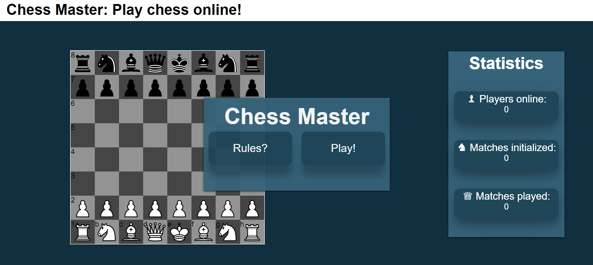
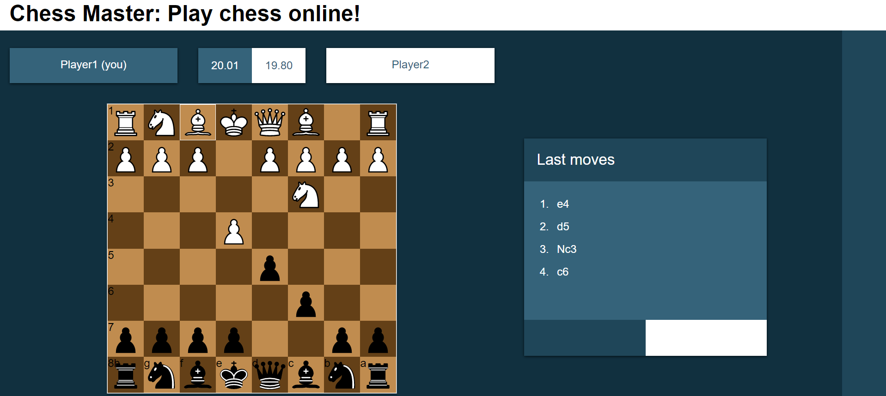

# Chess game web application for CSE1500





This chess game is developed for the course CSE1500.

To play the game, make sure you have Node.js installed as well as git.
To start the game, execute the following step:

```console
git clone git@gitlab.com:niekbrouwer/chess-game.git
cd ChessGame
npm install
npm start
```

You can now access the game at [http://localhost:3000/](http://localhost:3000/) in the browser. Open another browser window to access the game as another player.
